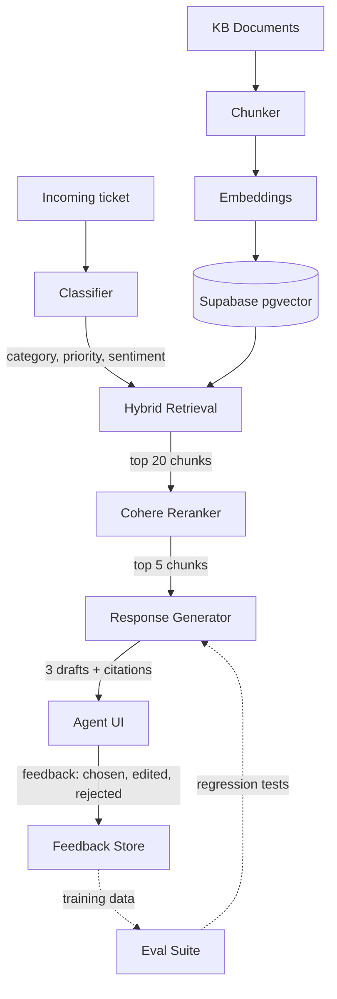

# Support Copilot

[](https://github.com/amihailow/support-copilot/actions/workflows/ci.yml)
[](./LICENSE)
[](.nvmrc)

> AI assistant for human support agents - not a chatbot that replies to customers.

Support teams burn $40-80/ticket on manual response writing. Existing AI tools either replace the agent (bad UX, hallucinations, brand risk) or are glorified search bars. Support Copilot sits next to the agent: classifies the ticket, retrieves grounded answers from the knowledge base, and suggests 3 response drafts with source citations. The agent stays in control.

## What makes this "not just another chatbot"

- AI never talks to the customer. Agent always reviews and sends.
- Every suggested response is grounded: clickable citations to the KB articles used.
- Hybrid retrieval (BM25 + dense vectors + Cohere reranker), not naive vector search.
- Confidence scoring per suggestion. Low-confidence tickets get auto-flagged for human review.
- Production observability with Langfuse - every retrieval and generation is traced.
- Eval suite with 100+ real ticket-response pairs. Metrics gate every prompt change.

## Architecture



## Stack

- **Frontend + Backend:** Next.js 16 (App Router) + TypeScript + Tailwind v4
- **Database + Vectors:** Supabase Postgres with pgvector
- **LLM:** Anthropic Claude (Haiku 4.5 for classification, Sonnet 4.5 for generation)
- **Embeddings:** OpenAI `text-embedding-3-small`
- **Reranker:** Cohere `rerank-3.5`
- **Observability:** Langfuse Cloud
- **Evals:** Promptfoo
- **Deploy:** Vercel

## Eval results (mock pipeline, 8 cases)

| Metric | Value | Target | Status |
| --- | --- | --- | --- |
| category_accuracy | 100.0% | >= 85% | pass |
| priority_accuracy | 100.0% | >= 75% | pass |
| citation_recall | 100.0% | >= 85% | pass |
| required_phrase_coverage | 100.0% | >= 90% | pass |
| prohibited_phrase_violations | 0 | < 1 | pass |
| faithfulness_proxy | 1.000 | >= 0.85 | pass |
| latency_p95_ms | ~610ms | < 3500 | pass |
| cost_per_ticket_usd | ~$0.025 | < 0.05 | pass |

Reproduce: `npm run eval`. Full methodology and case-by-case breakdown in [evals/RESULTS.md](./evals/RESULTS.md), test dataset in [evals/dataset.yaml](./evals/dataset.yaml).

Live-mode targets (with real LLM calls) are stricter: faithfulness > 0.90 via LLM-as-judge, top-1 retrieval recall > 0.85, agent acceptance rate > 45%. Numbers above are from the deterministic mock pipeline used for local development and CI.

## CI and observability

- **CI gate (`.github/workflows/ci.yml`):** every PR runs typecheck, vitest unit tests, the eval suite, and a production build. A regression on any metric target blocks the merge.
- **Unit tests (`npm run test`):** 19 vitest cases against the scoring library. Pure functions, no API calls.
- **Tracing (`src/lib/observability.ts`):** every pipeline run emits a Langfuse trace with classify / retrieve / rerank / generate spans, including latency, cost, model, and full I/O. Falls back to a no-op when `LANGFUSE_PUBLIC_KEY` / `LANGFUSE_SECRET_KEY` are absent, so local dev stays zero-config.

## Project structure

```
support-copilot/
├── src/
│   ├── app/                    # Next.js App Router
│   │   ├── api/                # API routes
│   │   ├── dashboard/          # Agent UI
│   │   └── page.tsx            # Landing
│   ├── components/             # React components
│   ├── lib/
│   │   ├── llm.ts              # Anthropic / OpenAI clients
│   │   ├── embeddings.ts       # Embedding generation
│   │   ├── retrieval.ts        # Hybrid search (BM25 + vector)
│   │   ├── rerank.ts           # Cohere reranker
│   │   ├── classify.ts         # Ticket classifier
│   │   ├── generate.ts         # Response generator
│   │   ├── db.ts               # Supabase client
│   │   └── utils.ts            # Helpers
│   └── types/                  # Shared TypeScript types
├── supabase/
│   └── schema.sql              # Database schema
├── data/
│   └── sample-kb/              # Sample knowledge base for demo
├── evals/
│   ├── dataset.yaml            # Test ticket-response pairs
│   ├── promptfoo.config.yaml   # Eval config
│   └── RESULTS.md              # Metrics history
└── docs/
    └── architecture.md         # Detailed design notes
```

## Running locally

```bash
git clone https://github.com/amihailow/support-copilot.git
cd support-copilot
npm install
npm run dev
```

Open `http://localhost:3000`. The app runs in mock mode out of the box - the UI works against an in-process seed cache.

For the live pipeline (real LLM calls, real retrieval), see [SETUP.md](./SETUP.md). Free-tier accounts on Anthropic + OpenAI + Cohere + Supabase + Langfuse get you ~5000 tickets through the live pipeline for $0.

```bash
cp .env.example .env.local
# fill in keys, then:
npm run check-env       # validates everything is set
npm run ingest          # KB markdown -> chunks -> embeddings -> Supabase
npm run seed            # sample tickets -> Supabase
npm run dev
```

## Scripts

| Script | What it does |
| --- | --- |
| `npm run dev` | Start Next.js in dev mode |
| `npm run build` | Production build |
| `npm run start` | Run production build |
| `npm run typecheck` | TypeScript validation across the whole project |
| `npm run check-env` | Validate all required environment variables and print what is missing |
| `npm run db:migrate` | Reminder to apply `supabase/schema.sql` |
| `npm run ingest` | Chunk and embed KB documents, insert into Supabase |
| `npm run seed` | Load sample tickets into Supabase |
| `npm run eval` | Run the eval suite, write `evals/RESULTS.md`, exit 1 if any target missed |
| `npm run test` | Run vitest unit tests for the scoring library |

## Roadmap

- [x] Project scaffold and architecture
- [x] Type system, library modules, KB schema
- [x] Mock pipeline + agent dashboard UI
- [x] `/api/suggest`, `/api/tickets`, `/api/feedback`
- [x] Pipeline orchestration with live + mock paths
- [x] In-app trace viewer per request
- [x] KB ingestion script
- [x] Sample tickets seed script
- [x] Eval runner with metric gating (8 cases, all targets met)
- [x] Langfuse traces wired up (no-op when keys are absent)
- [x] Vitest unit tests for the scoring library (19 tests)
- [x] GitHub Actions CI: typecheck + tests + evals + build on every PR
- [ ] Agent feedback loop persisted in Supabase
- [ ] CI workflow (typecheck + evals on PR)
- [ ] Vercel deploy with environment instructions
- [ ] Demo video and case study

## License

MIT
